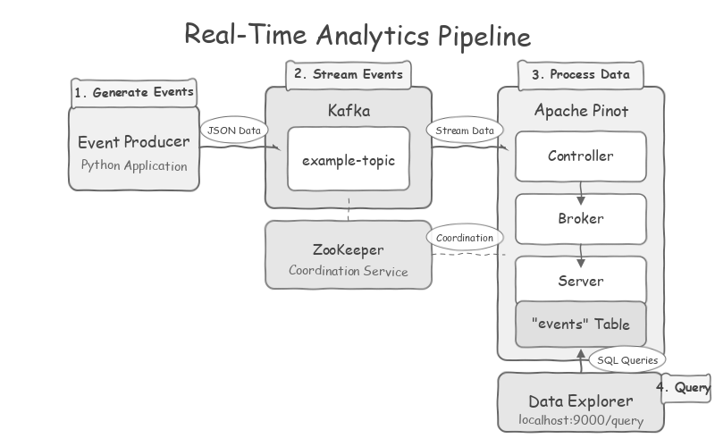
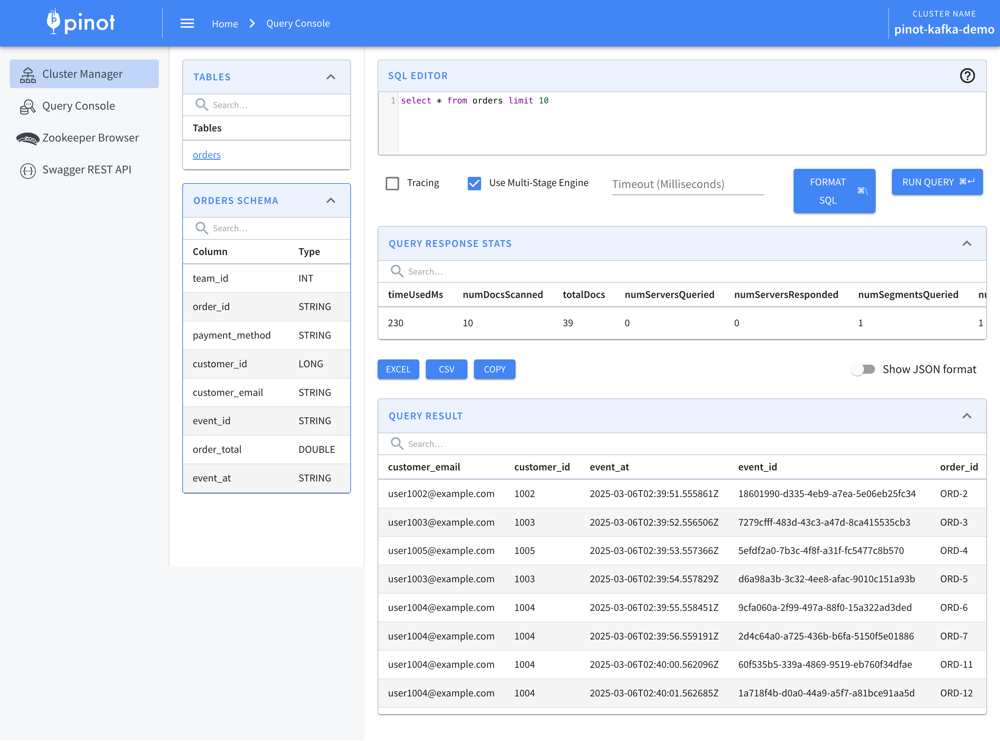
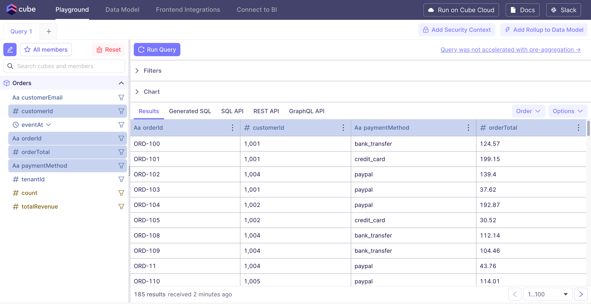

# Real-Time Analytics Pipeline with Kafka, Apache Pinot and Cube

This project sets up a real-time analytics pipeline using Apache Kafka as the message queue, Apache Pinot as the real-time analytics database, and Cube as the analytics API platform. It includes a simple order producer that generates order events with nested JSON structure and publishes them to Kafka, which are then consumed by Pinot for real-time analysis and made available through Cube for visualization and exploration.

## Architecture



The pipeline consists of:

- **Zookeeper**: For coordination between Kafka and Pinot components
- **Kafka**: Message broker for handling event streams
- **Event Producer**: Python application that generates order events
- **Apache Pinot**: Real-time analytics database with components:
  - Controller: Manages the Pinot cluster
  - Broker: Handles queries
  - Server: Stores and processes data
- **Cube**: Semantic layer platform that provides:
  - Data modeling layer
  - Analytics API
  - Playground for exploring and visualizing data

## Getting Started

### 1. Clone the repository

```bash
git clone git@github.com:zacharywelch/pinot-demo.git
cd pinot-demo
```

### 2. Start the services

```bash
# Build and start all services
docker-compose down -v
docker-compose up -d --build
```

### 3. Set up Pinot

```bash
# Run the setup script to create schema and table
./setup-pinot.sh
```

### 4. Verify data is being produced
```bash
docker logs -f event-producer
# Press Ctrl+C after a few seconds
```

### 5. Verify the setup

Access the Pinot UI at http://localhost:9000 and navigate to the Query Console to run some queries.

Example query:
```sql
SELECT COUNT(*) FROM orders
```


### 6. Explore with Cube

Access the Cube Playground at http://localhost:4000 to build and visualize queries.
In the Cube Playground, you can build queries using the visual query builder:

1. Select the `Orders` cube
2. Add measures like `Orders.count` or `Orders.totalRevenue`
3. Add dimensions like `Orders.paymentMethod`
4. Run the query and visualize the results



## Troubleshooting

If you encounter any issues with the pipeline:

### No events in Pinot or Cube

Check the producer logs:
```bash
docker logs event-producer
```

Check the Pinot server logs:
```bash
docker logs pinot-server
```

Check the Cube logs:
```bash
docker logs cubejs
```

### Rebuilding after code changes

Always rebuild containers after making code changes:
```bash
docker-compose down -v
docker-compose up -d --build
```

## Project Structure

```
├── docker-compose.yml          # Main configuration for services
├── setup-pinot.sh              # Script to set up Pinot schema and table
├── producer/                   # Event producer application
│   ├── Dockerfile              # Container definition for producer
│   ├── requirements.txt        # Python dependencies
│   └── producer.py             # Python event generator code
├── pinot-config/               # Pinot configuration files
│   ├── schema.json             # Defines the data structure
│   └── table.json              # Defines how data is stored and queried
└── cube/                       # Cube configuration files
    ├── cube.js                 # Main Cube configuration
    └── model/                  # Data models directory
        └── cubes/              # Cube definitions
            └── Orders.js       # Orders cube definition
```

## Schema Definition

The `orders` table schema includes:

- `event_id` (STRING): Unique identifier for each event
- `tenant_id` (INT): Tenant identifier for the order
- `event_at` (TIMESTAMP): ISO format timestamp
- `event_type` (STRING): Type of order event
- `order_id` (STRING): Identifier for the order
- `order_total` (DOUBLE): Total value of the order
- `payment_method` (STRING): Method used for payment
- `customer_id` (LONG): Customer identifier
- `customer_email` (STRING): Customer's email address

## Customizing

### Changing Event Generation

To modify the event data structure or generation frequency:

1. Edit `producer/producer.py`
2. Update schema in `pinot-config/schema.json`
3. Update table configuration in `pinot-config/table.json`
4. Update Cube model in `cube/model/cubes/Orders.js`
5. Rebuild and restart:
   ```bash
   docker-compose down -v
   docker-compose up -d --build
   ./setup-pinot.sh
   ```

## Further Resources

- [Apache Kafka Documentation](https://kafka.apache.org/documentation/)
- [Apache Pinot Documentation](https://docs.pinot.apache.org/)
- [Cube Documentation](https://cube.dev/docs)
- [Pinot Connector for Cube](https://cube.dev/docs/product/configuration/data-sources/pinot)
- [Real-Time Analytics with Pinot](https://docs.pinot.apache.org/basics/components/table#real-time-table)
